## every-noise

3D every(where) noise javascript class for all your noise needs. 20kb minified, dependency-free.

- seeded noise
- scaling, pow
- fBM noise
- domain warping
- ridged noise
- billowed noise
- stepped noise
- tileable noise
- set properties of noise to own noise object (e.g. set noise.scale = new Noise());
- erosion-like fBM

- combined noise

### how to use

#### import

```html
<script src="https://flo-bit.github.io/every-noise/noise.js"></script>
```

#### create noise object

```javascript
// optionally pass in settings object
let noise = new Noise();
```

#### get noise value

```javascript
// z and w are optional
let value = noise.get(x, y, z, w);
```

OR

```javascript
// vector has {x, y, (optional) z, (optional) w} properties
let value = noise.get(vector);
```

#### also included

- Vector class (2D, 3D, 4D) with vector math functions

- [jsrand](https://github.com/DomenicoDeFelice/jsrand) for seeded pseudo random number generation

### current version

this is a work in progress, so expect bugs and changes. until version 1.0.0 is released, the api as well as noise results may change.

#### v0.0.2 (2022-12-31)

- added more examples
- added performance test
- added prng for seeded noise

#### v0.0.1 (2022-12-27)

- initial release

### demos

#### simple (p5.js)

[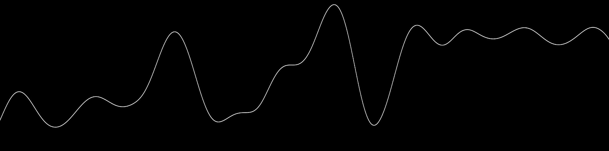](https://flo-bit.github.io/every-noise/demos/p5-simple-1D-noise.html)
[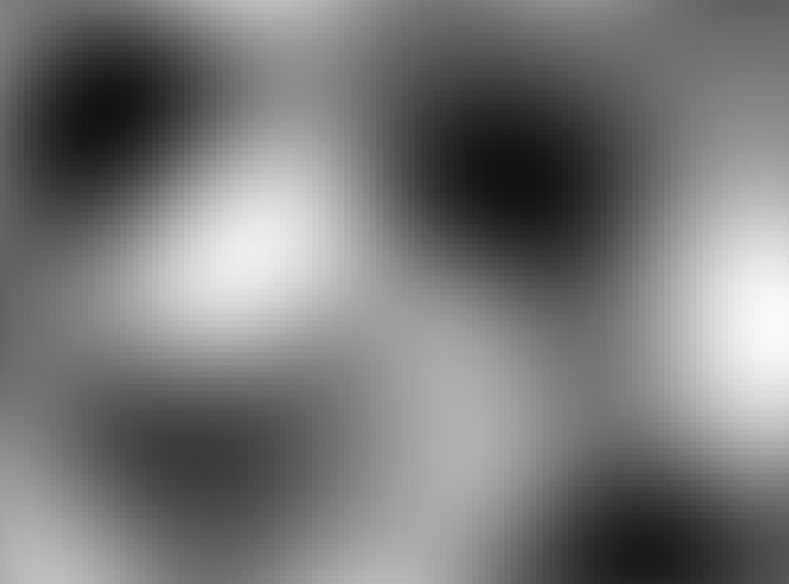](https://flo-bit.github.io/every-noise/demos/p5-simple-2D-noise.html)

#### tileable (p5.js)

[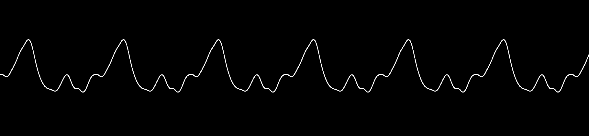](https://flo-bit.github.io/every-noise/demos/p5-tileable-1D-noise.html)
[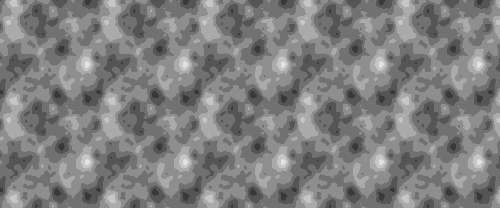](https://flo-bit.github.io/every-noise/demos/p5-tileable-2D-noise.html)

#### fBm (p5.js)

[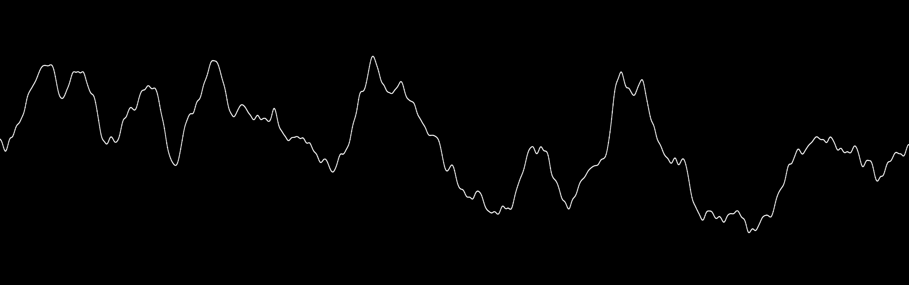](https://flo-bit.github.io/every-noise/demos/p5-fbm-1D-noise.html)
[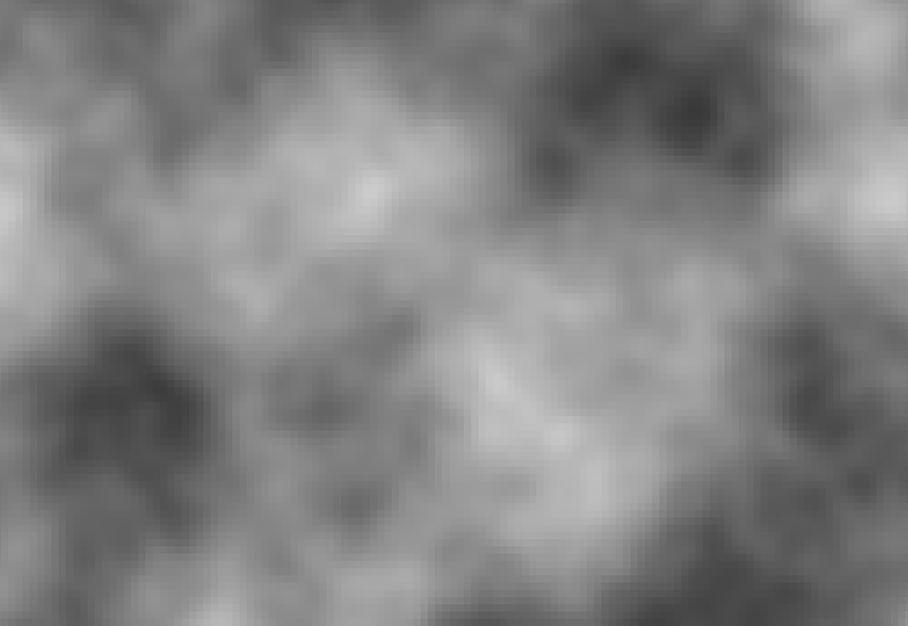](https://flo-bit.github.io/every-noise/demos/p5-fbm-2D-noise.html)

#### seeded (p5.js)

[2D noise](https://flo-bit.github.io/every-noise/demos/p5-seeded-2D-noise.html)

#### stepped (p5.js)

[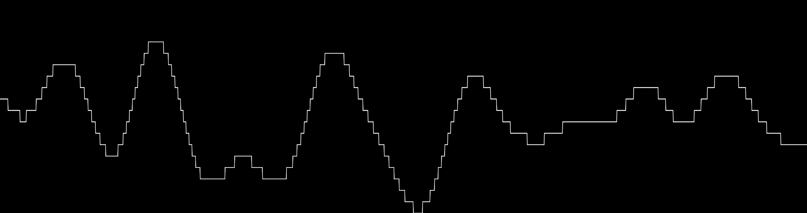](https://flo-bit.github.io/every-noise/demos/p5-stepped-1D-noise.html)
[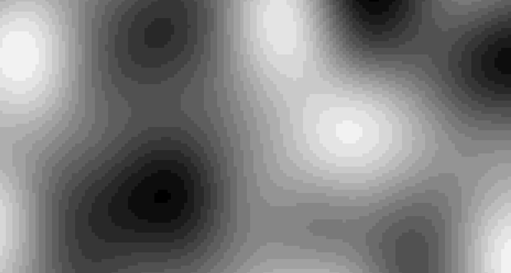](https://flo-bit.github.io/every-noise/demos/p5-stepped-2D-noise.html)

#### ridged (p5.js)

[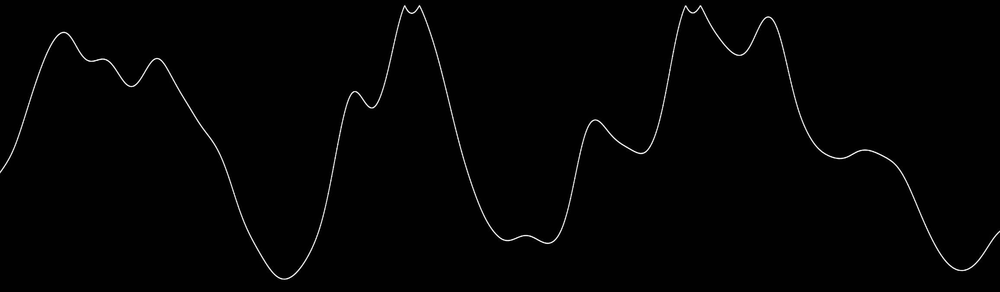](https://flo-bit.github.io/every-noise/demos/p5-ridged-1D-noise.html)
[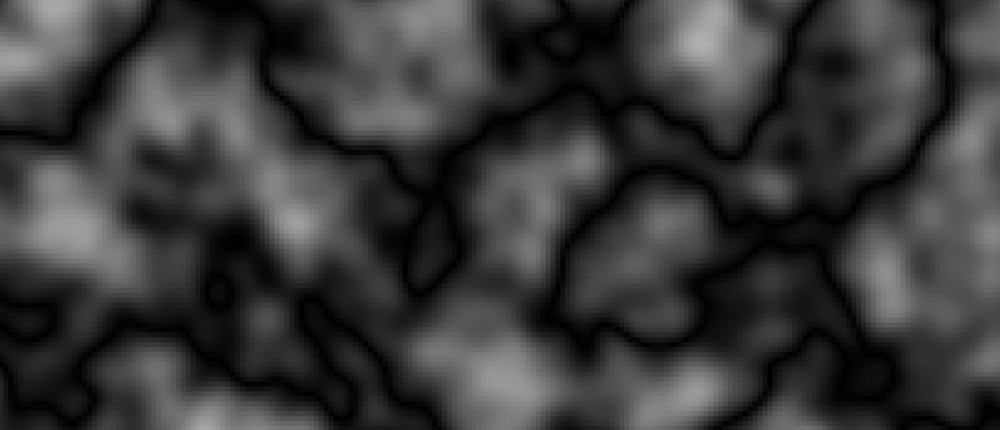](https://flo-bit.github.io/every-noise/demos/p5-ridged-2D-noise.html)

#### billowed (p5.js)

[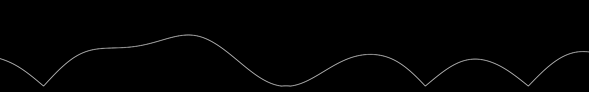](https://flo-bit.github.io/every-noise/demos/p5-billowed-1D-noise.html)
[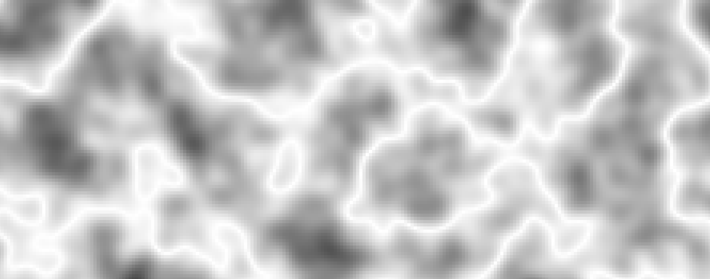](https://flo-bit.github.io/every-noise/demos/p5-billowed-2D-noise.html)

#### warped (p5.js)

[1D noise](https://flo-bit.github.io/every-noise/demos/p5-warped-1D-noise.html)

[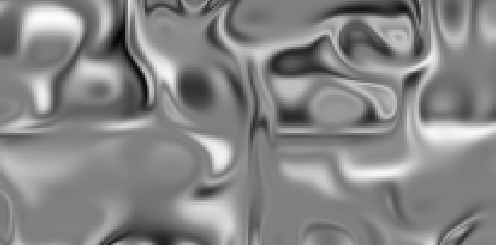](https://flo-bit.github.io/every-noise/demos/p5-warped-2D-noise.html)

#### advanced (p5.js)

[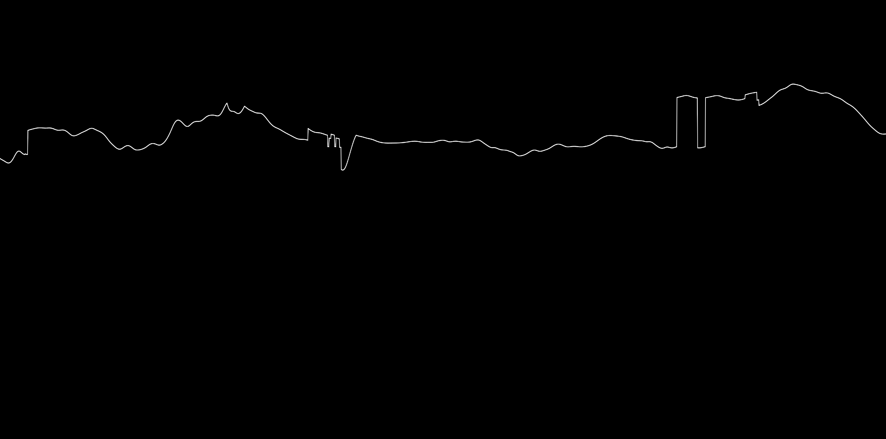](https://flo-bit.github.io/every-noise/demos/p5-advanced-1D-noise.html)
[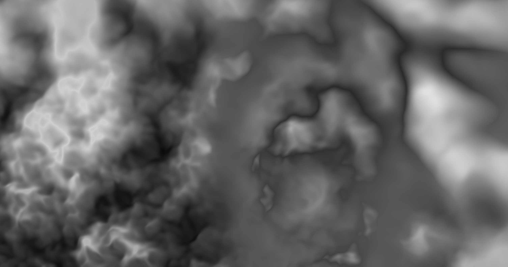](https://flo-bit.github.io/every-noise/demos/p5-advanced-2D-noise.html)

#### simple 3D noise on sphere (three.js)

[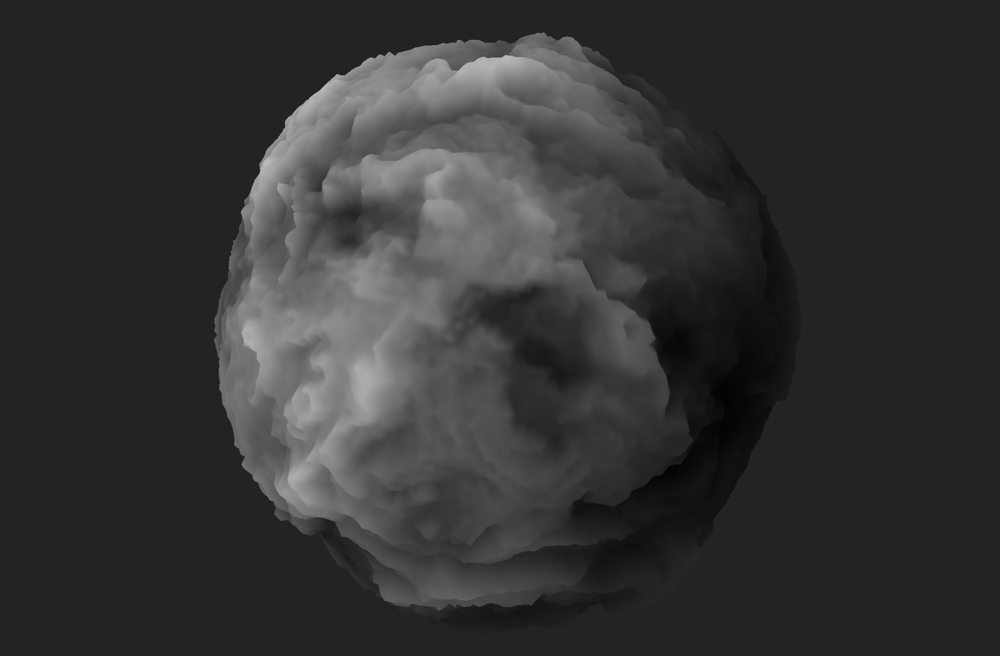](https://flo-bit.github.io/every-noise/demos/three-simple-3D-sphere.html)

#### performance test

[performance test v1](https://flo-bit.github.io/every-noise/demos/performance-test.html)

### future examples

- erosion 1D noise

- erosion 2D noise

- erosion on sphere

- pixi noise flow field

- adding gui to examples

## TODO

- add more noise types

- add more examples

- add gui to warped, ridged and simple 3D sphere example

## License

MIT License, see LICENSE file for details.
